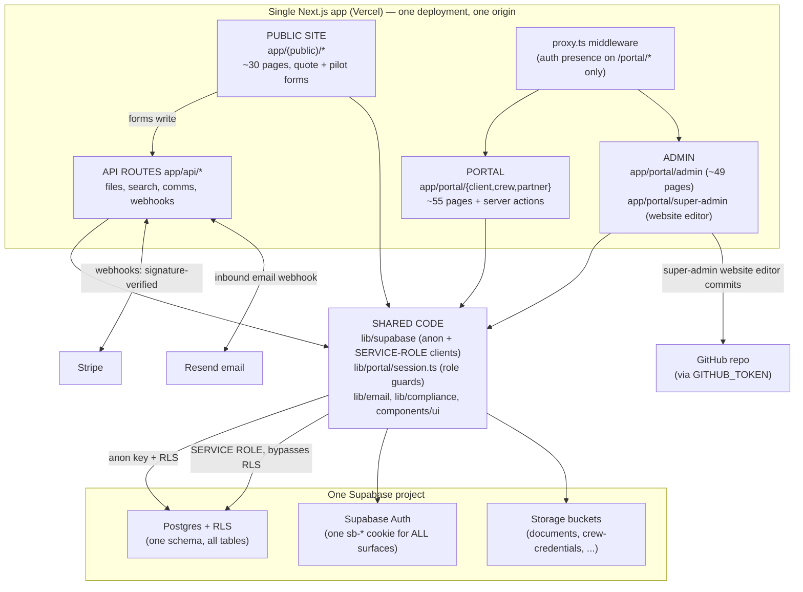

# Phase 1 — Boundary Mapping (public site / portal / admin)

## 1. Where the public site ends and the portal begins

- **Routing boundary:** `app/(public)/` (public marketing + auth pages) vs `app/portal/` (all authenticated surfaces). Clean route-group separation; no portal pages under public routes.
- **Middleware boundary:** `proxy.ts` (Next 16 middleware), matcher `["/portal/:path*"]`. It refreshes the Supabase session and redirects unauthenticated visitors of `/portal/*` to `/login`. It performs **no role check** — an authenticated client hitting `/portal/admin/...` passes middleware and is stopped only by page-level guards.
- **Template sharing:** root `app/layout.tsx` wraps everything; `app/(public)/layout.tsx` and `app/portal/layout.tsx` are separate below it. Portal chrome (`components/portal/shell/*`) is not used by public pages. Shared UI primitives (`components/ui/*`, shadcn) are used by both surfaces — presentation-only, low risk.

## 2. Where the admin lives, and its discoverability

- Admin backend: `app/portal/admin/` → **guessable URL `/portal/admin`** (plus `/portal/super-admin/website-editor` for the GitHub-committing website editor).
- `app/robots.ts` disallows `/portal/` and `/api/` (does not name `/admin` specifically — good). `app/sitemap.ts` lists only public routes. No admin links found in public HTML; the public nav links `/connect` → `/login`.
- No additional layer in front of admin: no separate hostname, no IP allowlist, no MFA step-up. Anyone with any approved portal account who escalates or any leaked admin session cookie reaches the full admin surface.

## 3. Enforcement model (who checks what, where)

| Layer | Mechanism | File | Notes |
|---|---|---|---|
| Middleware | auth presence only, `/portal/*` | `proxy.ts` | no role awareness |
| Page guards | `requireRole("admin")` on all 49 real admin pages; `requireUser()`/`requireRole(...)` on client/crew/partner pages; `requireSuperAdmin()` on website editor | `lib/portal/session.ts` | 15 "unguarded" pages verified to be pure `redirect()` alias stubs — no data exposure |
| Layouts | explicitly **not** a security boundary (documented in `components/portal/shell/role-layout.tsx`) | — | correct design |
| Server actions | `actor(roles)` helper (login + `status === "approved"` + role) | `app/portal/actions/_helpers.ts` | 98 calls across 24 action modules; `admin.ts` uses `actor(["admin"])` in 23/27 exports — the 4 without are thin wrappers delegating to guarded functions. `documents.ts:61` and `messages.ts:53` use role-less `actor()` (any approved user) — ownership scoping reviewed in Phase 2 |
| API routes | per-route session checks + ownership checks; webhooks use signature verification | `app/api/**` | detail in Phase 2/4 |
| Database | Supabase RLS on anon-key client; **service-role client bypasses RLS** and is used in ~130 call sites incl. every admin action | `lib/supabase/server.ts` | detail in Phase 3 |

**Key structural fact:** `actor(roles)` and `requireRole(roles)` both contain `isAdminRole(user.role) || roles.includes(...)` — i.e. **admin/super_admin may enter every surface** (client, crew, partner). Deliberate, but it means one compromised admin account = every surface.

## 4. Shared components across the three surfaces

Shared by all surfaces (single app, single DB):

- **One Supabase project** — same Postgres, same auth instance, same storage buckets.
- **One session cookie** (Supabase `sb-*` cookies, host-wide `/` path). A logged-in public-site visitor, a portal client, and an admin all carry the same cookie type; there is **no separate admin session scope**.
- **One role model** — `profiles.role` (`client | crew | admin | partner | super_admin`), vocabulary in `lib/portal/constants.ts`.
- **Shared libraries** — `lib/supabase/*` (both clients), `lib/portal/*` (domain logic incl. `session.ts`, `audit.ts`), `lib/email/*`, `lib/compliance/*`, `components/ui/*`.
- **Public → DB writes:** public forms (`/request`, `/pilots/apply`, consent endpoint) write to the shared DB via server actions / API routes — the public site is not read-only against the shared database (uses service client in `app/api/compliance/consent`, `app/api/crew-network/applications`; see Phase 3).

## 5. Surface diagram

## 6. Phase 1 findings (carried to REPORT.md)

| # | Severity | Finding |
|---|---|---|
| B-1 | High | Admin lives at guessable `/portal/admin` with no extra layer (no separate host, IP allowlist, or MFA step-up); only per-page role checks separate it from a client session |
| B-2 | High | Single shared session scope across public/portal/admin — no session segregation between surfaces |
| B-3 | Medium | Middleware checks auth presence only; role enforcement is decentralized across ~150 per-page/per-action guard calls — one forgotten guard = silent privilege hole (current coverage verified complete, but the pattern is fragile) |
| B-4 | Medium | Admin/super_admin roles may enter every portal surface by design (`isAdminRole` bypass in both `requireRole` and `actor`) — enlarges blast radius of one admin account |
| B-5 | Low | Public site writes to the shared production DB via service-role client for consent + pilot applications (rate-limiting/abuse review in Phase 4) |
